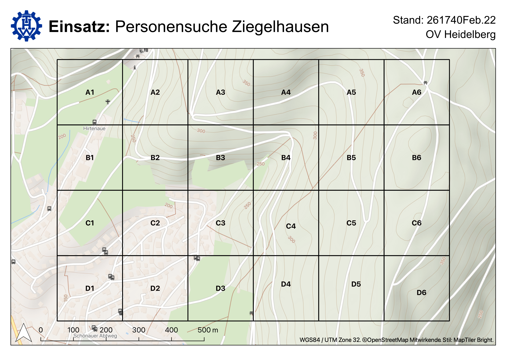
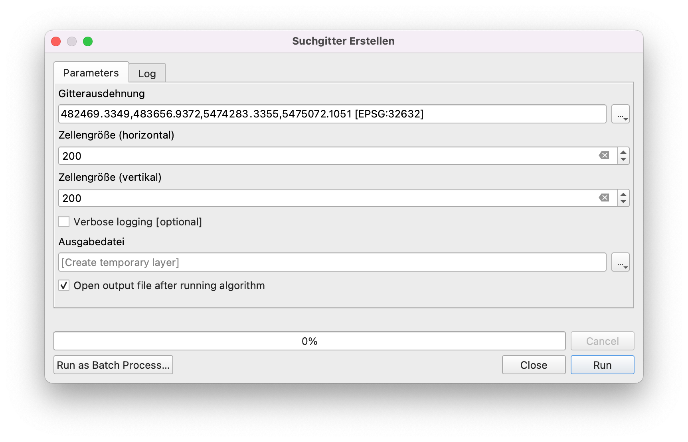

# THW Toolbox für QGIS

QGIS Toolbox für die Planung einer Personensuche durch das THW.  

## Software

Es wird [QGIS 3.24](https://www.qgis.org/de/site/forusers/download.html) oder [QGIS 3.22 (LTR)](https://www.qgis.org/de/site/forusers/download.html) benötigt. Ältere Versionen sollten auch funktionieren, aber es sollte mindestens QGIS 3.16 sein.

## THW-Toolbox installieren

1. QGIS Projekt öffnen.
2. Im Menu **Erweiterungen > Erweiterungen verwalten und installieren** öffnen.
3. Links auf **Aus ZIP installieren** klicken.
4. Unter **ZIP Datei** den Pfad zur Datei **thw-toolbox.zip** eingeben.
5. Auf **Erweiterung installieren** klicken. (Sicherheitswarnung mit ja beantworten).

## THW-Toolbox: Suchgitter erstellen

1. Im Menu **Verarbeitung > Werkzeugkiste** klicken.
2. Im Fenster "Verarbeitung" sollte ganz unten der Eintrag **THW** mit dem Tool **Suchgitter erstellen** erscheinen.
3. Nach dem Öffnen erscheint ein Dialogfenster, in dem das Suchgebiet sowie die Größe der Gitterzellen angegeben werden kann. Nachdem das Tool ausgeführt wurde, erscheint ein neuer Layer in QGIS, welcher das Suchgitter enthält.

